# Final Report - Sustainable Development (Group 28)

## Introduction
Our group is excited to explore the umbrella topic "Sustainable Development". Development has always been and will be the goal of humanity. However, in today's time where the environment is engendered, and as we experience its adverse effects such as climate change, the question arises what can be done to make this development sustainable? Hence, through this exploration, we aim to explore the three main factors of sustainable development. First, money through the target variable GDP. Second, health through the target variable life expectancy. Thirst, the environment through the target variable carbon dioxide emissions. All in all, we are interested in exploring how these three facts are influenced by the various other factors in the dataset.

## Exploratory Data analysis

We explored our dataset using various numpy and pandas functions like shape, describe and nunique. As part of the EDA we explored the missing values in dataset using, using the missing values matrix which can be seen below:

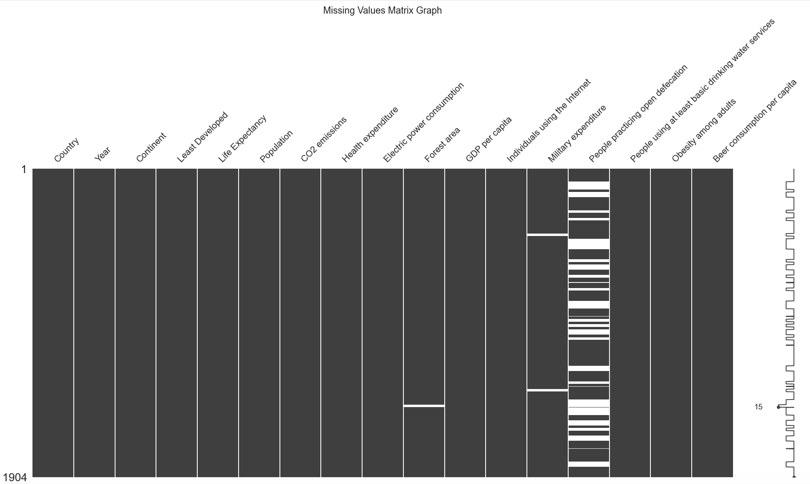

Looking at the graph above we can see there are a signficant number of missing values for the variable people practicing open defecation, which is understandable because this might be difficult to record.

Additionally, to understand the spread of variables, we made a violin plot for each of the variables. 

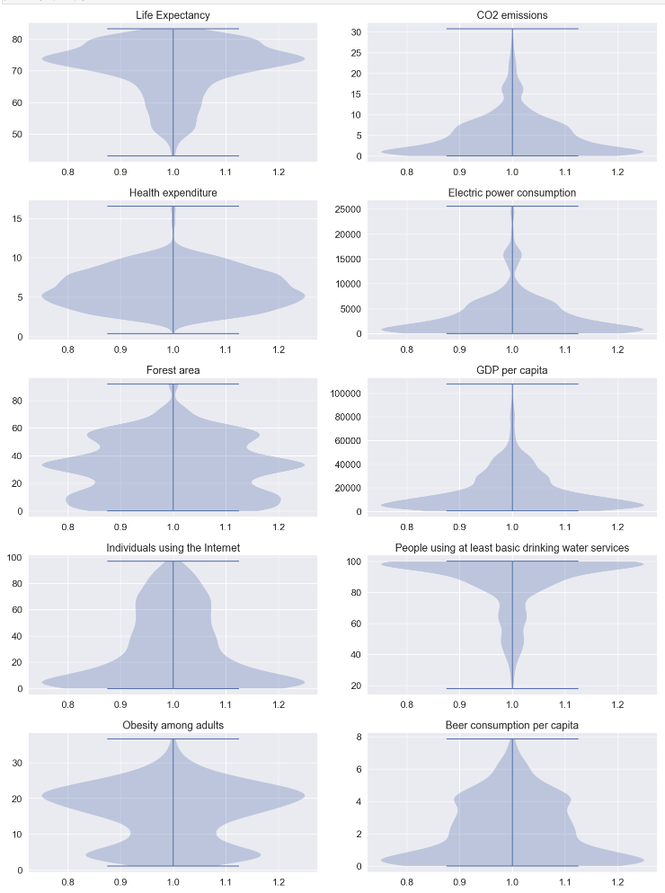

Looking at the graph above we can see that the variable Beer Consumption has the smallest spread, whereas, the variable GDP Per Capita has the biggest spread.

Next, we look at the relation between all the variables at a glance using the pairplot:

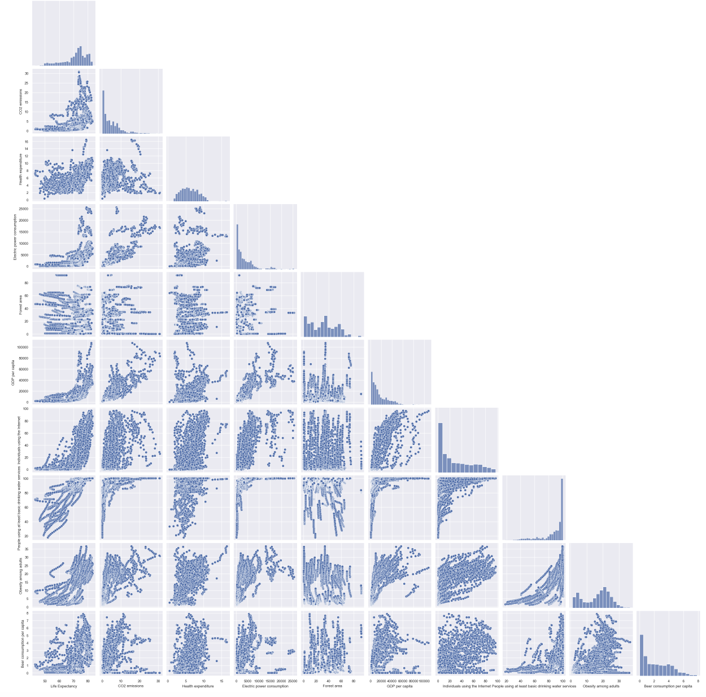

To understand the relation between all the variables better we then plotted a correlation matrix for the dataframe:

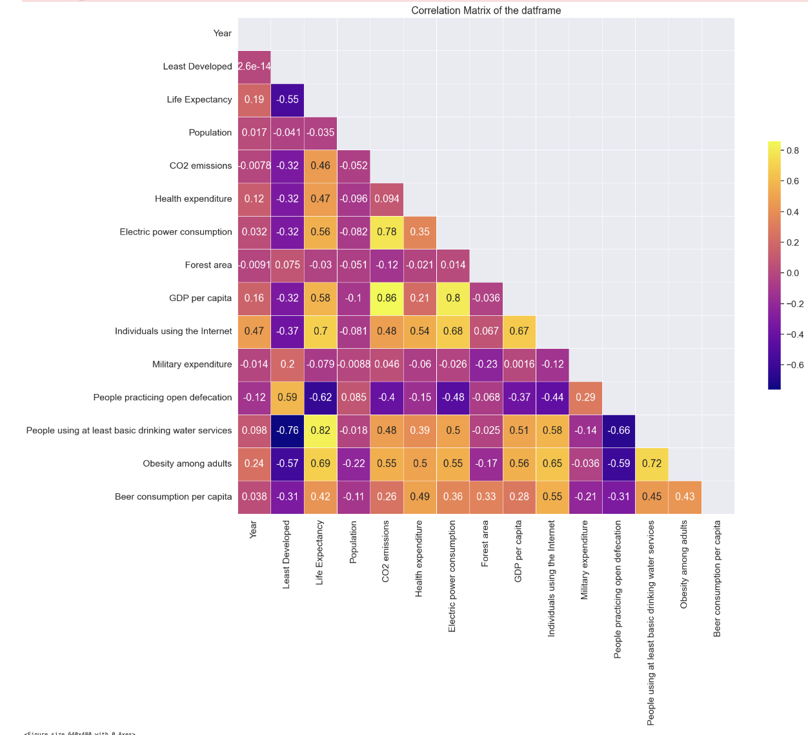

In the above correlation matrix we can see the correlation coefficiant of the all the variables in the dataframe.

## Research Topic 1: A Roadmap to a Greener Future: Understanding Factors Driving CO2 Emissions
**Global warming is a big issue that humanity is facing today and poses a great threat to our future. The adverse effects of which we have experienced firsthand here in Kelowna, with temperatures hitting the extremes, with all-time highs and lows. Last year's heatwave was definitely a strong reminder to many of us about the great risks global warming can pose. Carbon dioxide emissions are the leading causes of human-induced climate change, henceforth, I wish to explore what factors influence CO2 emissions which eventually cause climate change. The end goal is to find out the correlation between CO2 emissions and other variables.

I was first curious to know if there is a trend between the continents and carbon dioxide emissions. Is there continent that particularly stands out in terms of carbon dioxide emissions. 

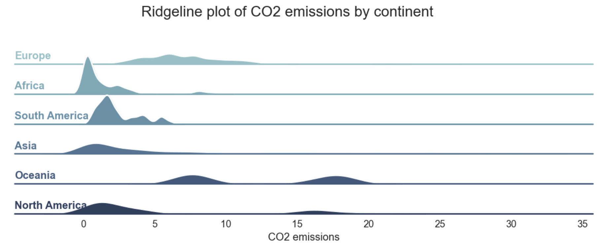

In the above ridgeline plot, we have grouped the entries by continent, and we can observe that there are certainly some continents that have the higher carbon dioxide emissions than other. On one hand we can observe that on an average the continent of Oceania is one with highest carbon dioxide emissions, but that is becuase in the dataset there is only one country in the continent of Oceania. On the other hand, we can observe that the continent of Africa has the lowest carbon dioxide emissions.

Saying so, we must also note that what we discussed is averages, but continents like Asia display some anomalous behaviour as they have outliers. Even though, on an average, Asia is not the continent with the highest carbon dioxide emissions, one of the countries in Asia has the highest carbon dioxide emissions in the world.

We can see a more visually appealing presentation of the same through geo maps in tableau as presented below:

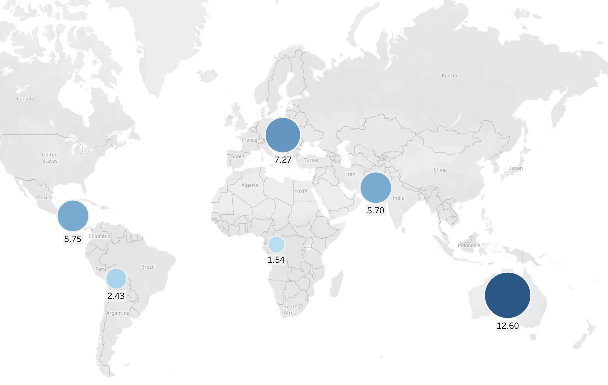

To understand the impact of geography on CO2 emmissions, we can see the CO2 emissions by country:

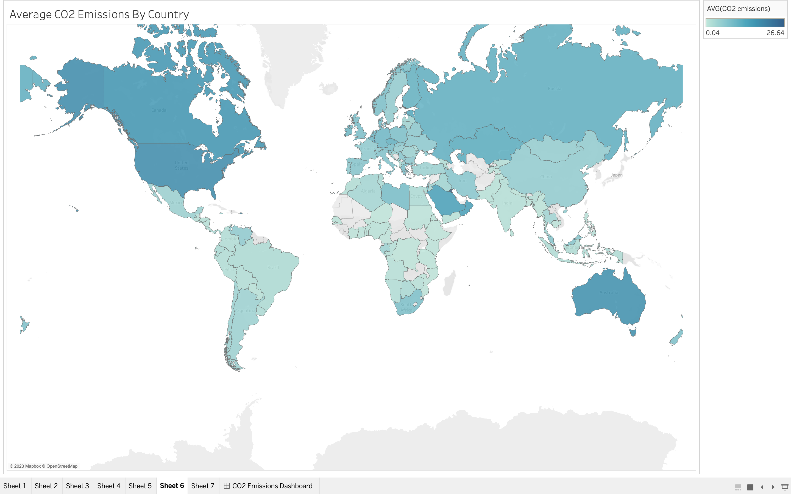

Another important factor that significantly impacts CO2 emissions is Electric Power Consumption

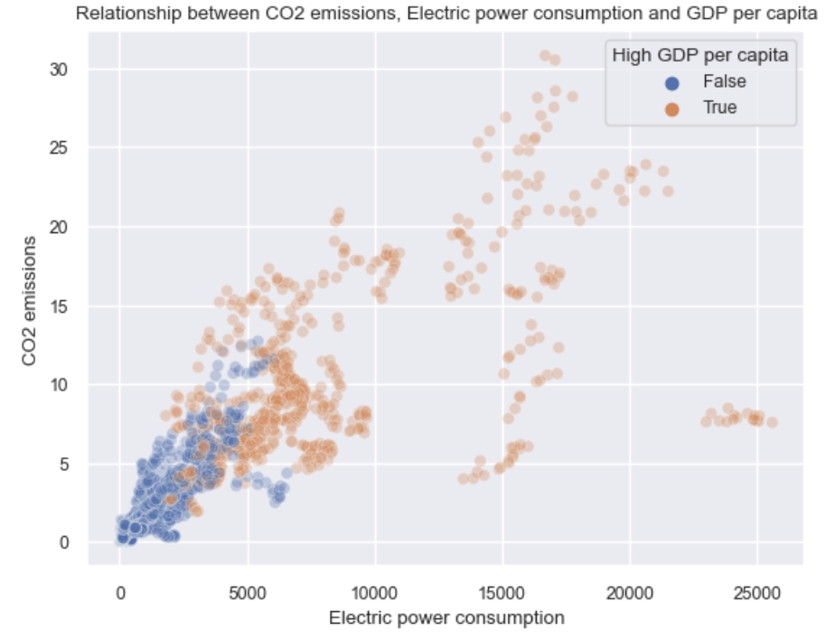

Here we can see positive correlation between the two factors - both electric power consumption and carbon dioxide emissions move in the same direction. Possibly due to the close connection between energy use and the generation of greenhouse gases, there is a positive correlation between CO2 emissions and electric power consumption. Energy use includes consumption of electric power, and when economies develop and grow, there is often an increase in the need for energy to run infrastructure, residences, and businesses. When fossil fuels like coal and oil, which are the main sources of electricity generation in many nations, are burned, the result is frequently a rise in CO2 emissions. 

The last factors that significantly impacts CO2 emisssions is GDP per capita:

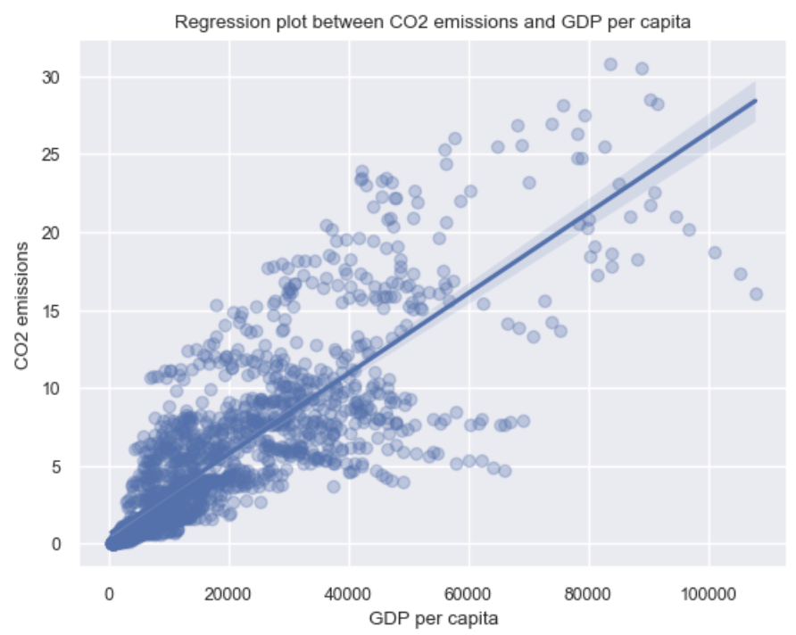

Through the regression plot we can see that the relaiton between the two variable is close to a linear relation. Looking at the correlation matrix displayed earlier we can see the correlation coefficient is 0.828 which suggests a strong positive correlation between the two variables GDP per capita and carbon dioxide emissions. This correlation is possible attributed to the fact that as a country's economy grows, so does its energy consumption, which is often met by fossil fuels such as coal, oil, and gas that emit CO2.

#### Conclusion:
Based on the exploratory data analysis conducted we can conclude that that are numerous factors that influence carbon dioxide emissions. According to the analysis, there is a correlation between carbon dioxide emissions and continent, a country's level of development, how much electricity is used, and GDP per capita. The continent of Oceania stands out as having the largest carbon dioxide emissions, whilst Africa has the lowest emissions. Additionally, Carbon dioxide emissions are often higher in nations with higher levels of economic development and electric power usage. The investigation also revealed a strong positive association between GDP per capita and carbon dioxide emissions, which shows that carbon dioxide emissions increase with GDP per capita. Overall, the analysis suggests that countries' economic development and power consumption play the most crucial role in their carbon dioxide emissions.

## Research Question 3: Uncovering the driving forces behind GDP per capita

Our third research question aimed to investigate how GDP per capita of a country affects other variables like Health Expenditure,CO2 emissions and Forrest area.From the hexbinplot below,we can see countries with the highest GDP per capita are the ones with least amount of health expenditure 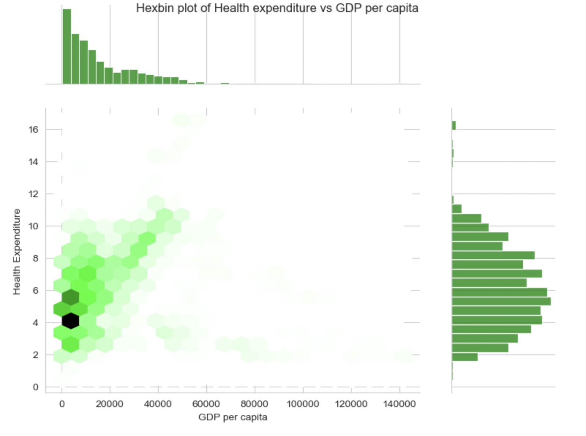
As we can see from the scatterplot below countries with the highest GDP per capita like USA,Qatar,Singapore and Hong Kong have the highest CO2 emissions,which was expected since they are highly industrialised thus more factories emitting greenhouse gases like CO2.   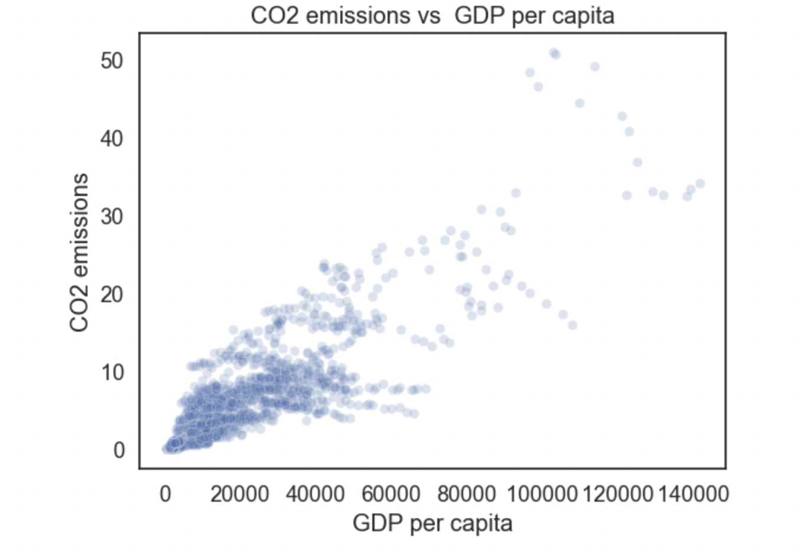 
We can infer from the below  hexbin graph that super rich countries(high GDP per capita countries) have extremely low forrest area since many of these countries are micro nations like Singapore,Malta,Luxembourg,Hong Kong and Qatar.Thus they can't afford to dedicate a sizable portion of their land for nature or greenery and thus comprimise it for industries like Petroleum and Oil rigs.
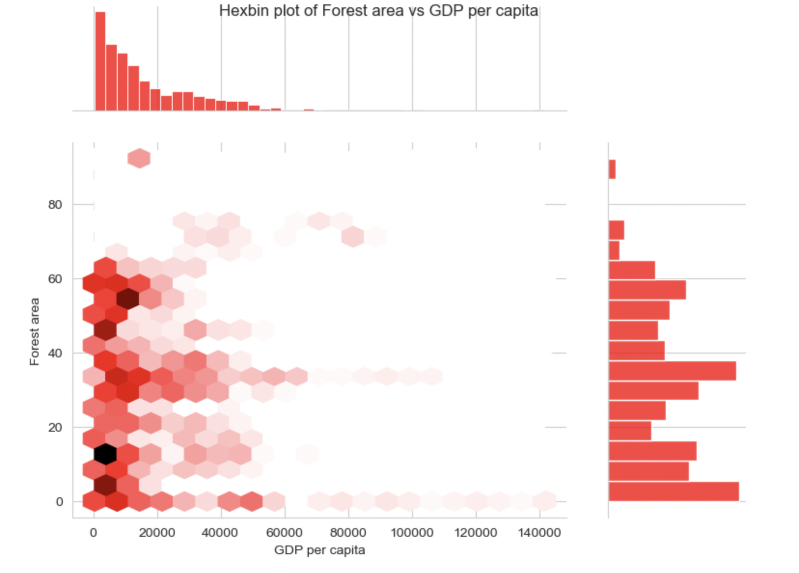
Moreover,I focused on understanding the common factors and trends amongst high GDP and low GDP countries.For example what are the common features or attributes amongst the rich countries.Rich countries(high GDP countries) have a strong postive correlation with CO2 emissions and Electric power consumption and light positive correlation with indiviuals using the internet.I already explained the reason for CO2 emissions, while Electric power consumption and indiviuals using the internet are strong signs of a developed country as they indicate a good quality of life as greater number of people have access to resources like internet and television.
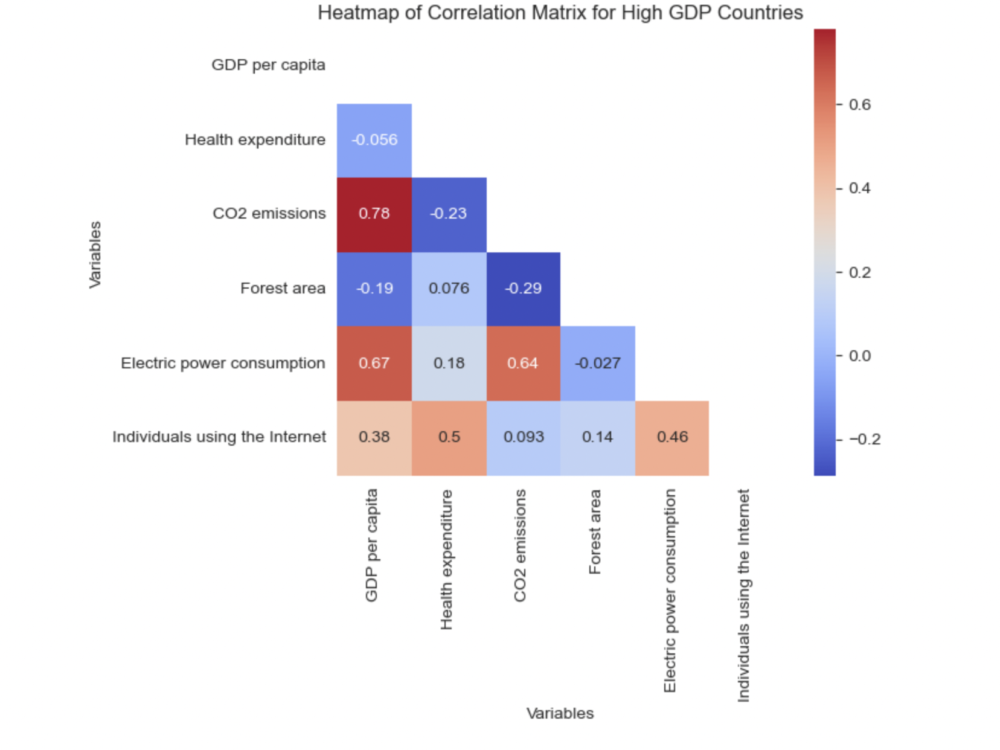
I also wanted to find out if countries with High GDP that have relatively low life expectancy spend more on military than health sector? As we can see from the observations and filtering of the 10 richest countries by GDP per capita,and all of them have underwhelimng life expectancy for such rich nations, and the answer is obvious since most of them spend their GDP on military rather than healthcare.
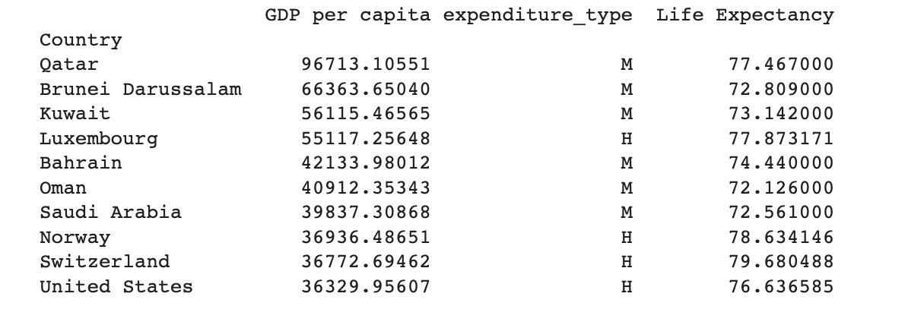
Moreover, we can infer from the dual barplot shown below of a super rich country like Qatar, that it's military spending trumped it's health spending for sizable period of time.
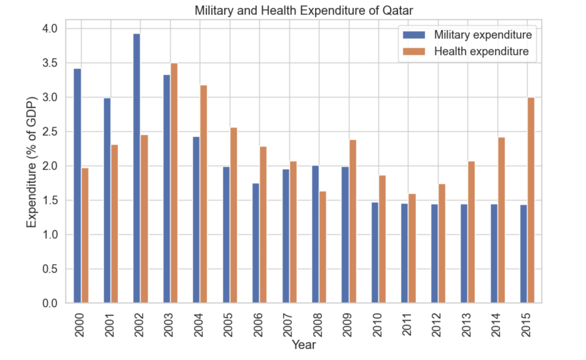

#### Summary/Conclusion
In conclusion,from my analysis I learned that rich countries might have lower life expectancy due to them not spedning enough on the health sector and instead countries with such high GDP per capita like the USA and Qatar spending money overwhelming on other sectors like (military for USA) and (petroleum extraction for Qatar) while socialist nordic countries who pride themselves on their healthcare obviously spend a lot more on their Health sector.Also countries really high GDP per capita have to sacrifice a lot on other factors like forrest area and CO2 emissions since either due to limited area or high density of factories to keep the money flowing in.

[You can find the full analysis notebook here, including the code and the data.](https://github.com/ubco-W2022T2-data301/project-group-group28/blob/main/analysis/analysis3.ipynb)
